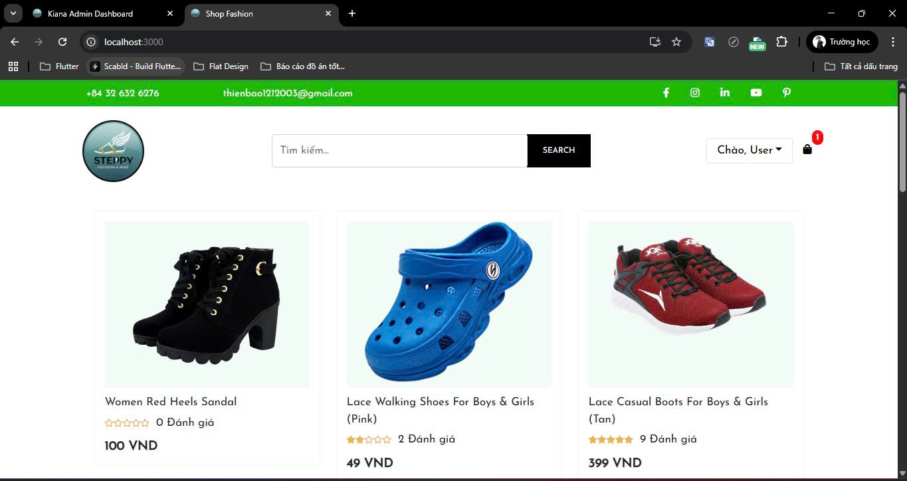
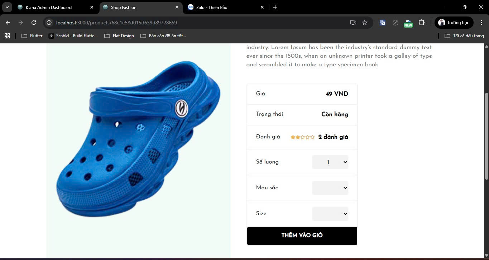
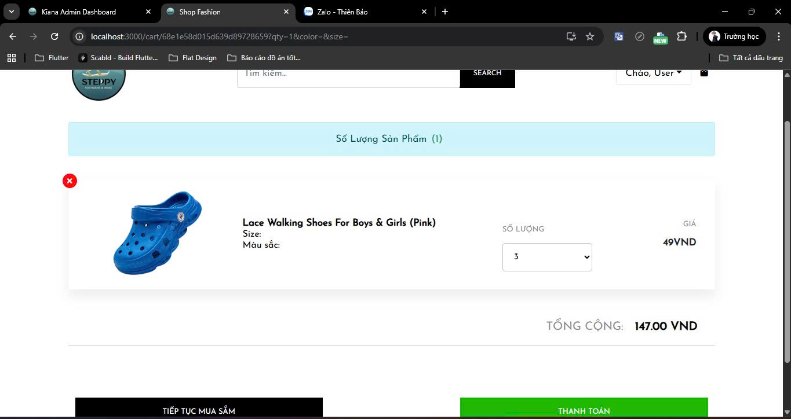
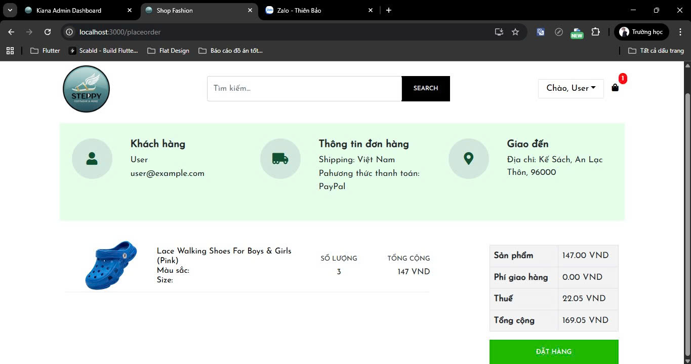
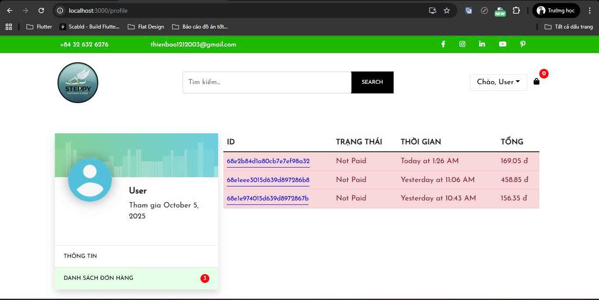
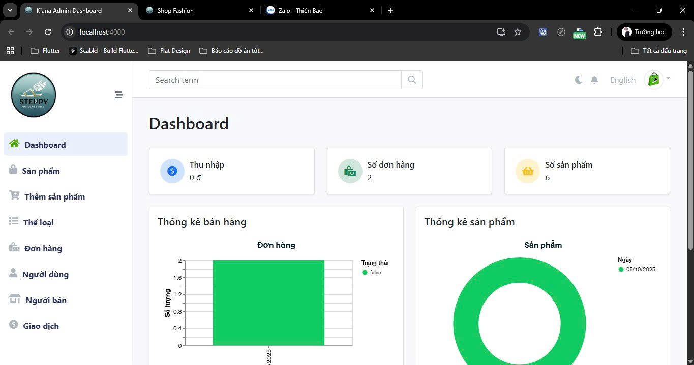
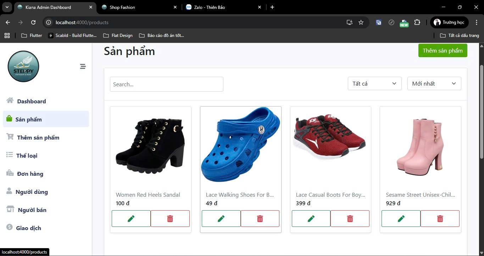
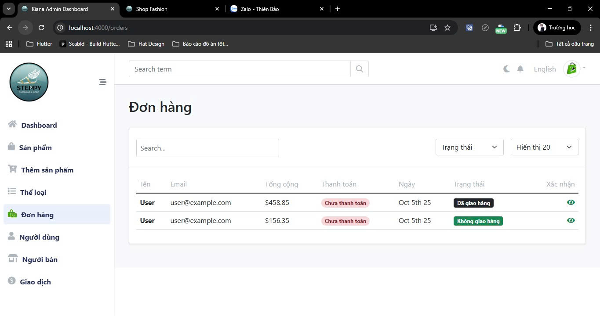
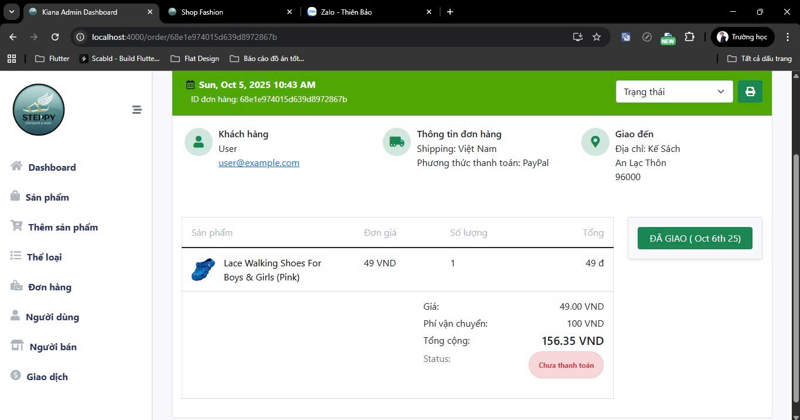

## Full-Stack E-Commerce App
A full-featured E-Commerce web application built with React.js for the frontend, Node.js + Express for the backend, Redux for state management, and MongoDB as the database. This app allows users to browse products, manage a shopping cart, place orders, make payments, track orders, and includes an admin dashboard for managing products, orders, and users.
## Screenshots
<!-- Web Screenshots -->
<h3>User</h3>
  
  
  
  
  

<!-- Mobile App Screenshots -->
<h3>Admin</h3>

 
  
  
  

## User Features
- Search products by name
- Add, update, and remove items from the shopping cart
- Place orders and make secure payments
- Track order status
- User authentication (signup/login) and profile management
## Admin Features
- Admin dashboard with login authentication
- Manage categories and products (create, update, delete)
- View, manage orders, and confirm delivery
- View sales statistics
- Manage users
## Technologies Used
- Frontend: React.js, Redux, React Router, Axios
- Backend: Node.js, Express.js
- Database: MongoDB (Mongoose ORM)
- Authentication & Security: JWT
## Prerequisites
- Node.js >= 16
- MongoDB (local or Atlas)
- npm or yarn
## License
This project is licensed under the MIT License – see the LICENSE file for details.
